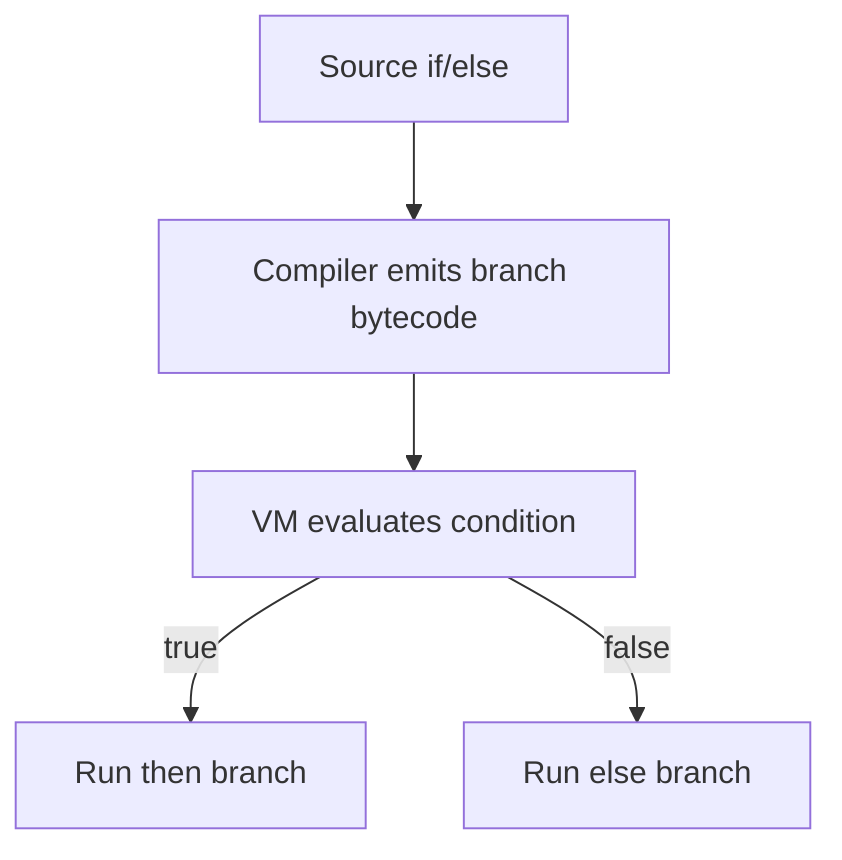

Control flow in Mutant is centered on `if` and `else` expressions that map to
branching behavior in the compiler and VM.

The current language model keeps control flow intentionally small and explicit.
That makes it easier to reason about how a source branch becomes bytecode and
how the runtime chooses a path when a condition evaluates.

## Pointers

- `if` and `else` are the core branching constructs in the current spec.
- Branches are evaluated by the compiler and VM together, not by a separate
  macro or preprocessing stage.
- The upstream bytecode reference is the source of truth for any branch opcode
  or operand change.

## Example

```mut
if (1 == 1) {
  putf("yes");
} else {
  putf("no");
}
```

## Flow



## Canonical Source

- [docs/BYTECODE_IR.md](https://github.com/aoiflux/mutant/blob/main/docs/BYTECODE_IR.md)
