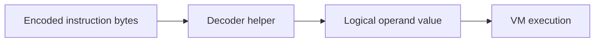

Operand decoding is part of the bytecode contract and must be handled through
the VM's decoder helpers instead of direct raw byte access.

This page exists to make the decoding boundary explicit. The encoded stream is
not the same thing as the logical operand value, especially when encryption or
width changes are involved.

## Pointers

- Always use the decoder helpers that understand the bytecode format.
- Treat direct indexing as unsafe for encrypted or width-sensitive operands.
- Keep operand format changes synchronized with the opcode table and VM logic.

## Decoding Path

## Canonical Source

- [docs/BYTECODE_IR.md](https://github.com/aoiflux/mutant/blob/main/docs/BYTECODE_IR.md)
