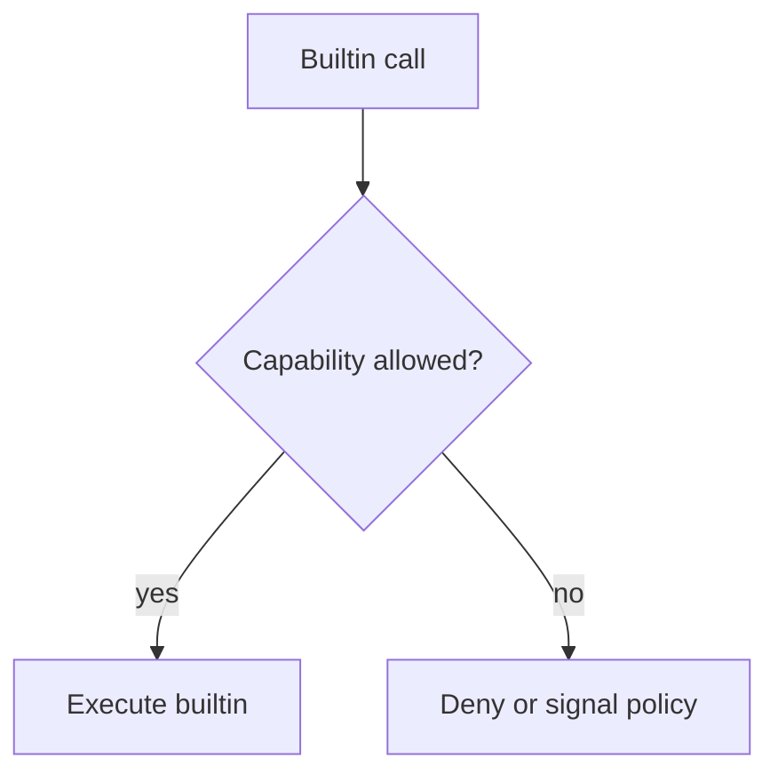

Some built-ins are gated behind explicit capabilities so that risky operations
stay opt-in.

This keeps execution predictable: the builtin exists in the language, but the
capability model decides whether the call is allowed in the current context.

## Pointers

- `command_exec` covers command-building and process-style operations.
- `filesystem` covers file reads, writes, and filesystem mutation.
- `network` covers sockets, HTTP, and remote access helpers.
- A missing capability should be treated as a policy decision, not a language
  parser error.

## Capability Groups

- `command_exec`
- `filesystem`
- `network`

## Model

## Canonical Source

- [builtin/builtin.go](https://github.com/aoiflux/mutant/blob/main/builtin/builtin.go)
