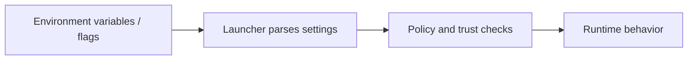

The security model relies on a defined set of environment variables and flags
that control execution, trust, and operational behavior.

These settings are the external contract between the user, the launcher, and the
runtime. When they change, the surrounding docs need to reflect both the name
and the behavior.

## Pointers

- Keep the environment contract aligned with the release pipeline and runtime
  gate checks.
- Distinguish build-time signing inputs from runtime policy inputs.
- Document any new `MUTANT_*` variable with its default and impact.

## Contract Flow

## Canonical Source

- [docs/SECURITY_LLD.md](https://github.com/aoiflux/mutant/blob/main/docs/SECURITY_LLD.md)
