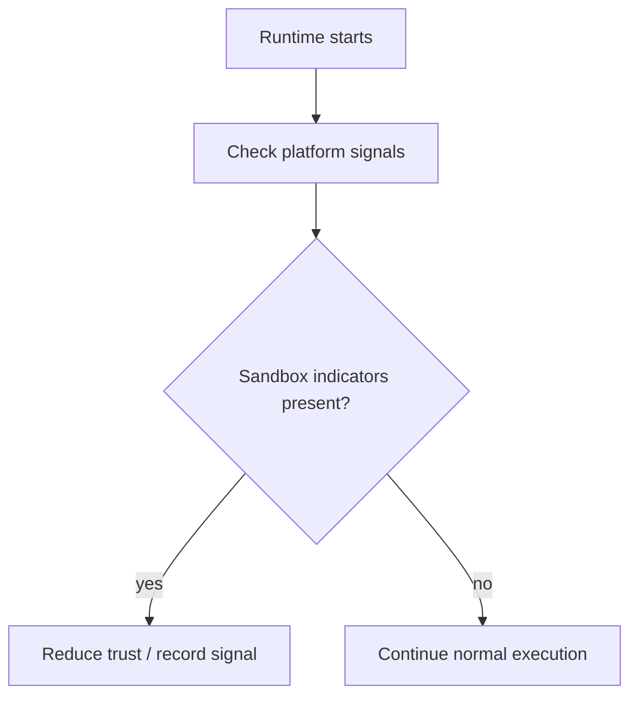

Sandbox detection documents the API contract and platform-specific checks used
to identify constrained execution environments.

The goal here is not to describe every platform quirk, but to explain what the
runtime considers when it decides whether it is running under restrictive or
instrumented conditions.

## Pointers

- Treat sandbox detection as an input to security posture, not a standalone
  policy layer.
- Platform-specific checks belong with their implementation details upstream.
- Keep the quick-start guidance aligned with the current detection surface.

## Detection Flow

## Canonical Source

- [docs/SANDBOX_DETECTION.md](https://github.com/aoiflux/mutant/blob/main/docs/SANDBOX_DETECTION.md)
