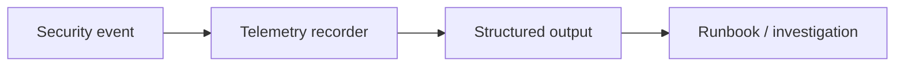

Telemetry records detection and policy decisions so operators can inspect how
the security layer behaved.

It is the observable trail for the security system: when a check fires, the
runtime records what happened so operators can correlate behavior with the
selected policy and environment.

## Pointers

- Keep the telemetry shape stable enough for runbook use.
- Document any new event type next to the policy or detection feature that emits
  it.
- Prefer concise, actionable fields over verbose dumps.

## Telemetry Flow

## Canonical Source

- [security/telemetry.go](https://github.com/aoiflux/mutant/blob/main/security/telemetry.go)
